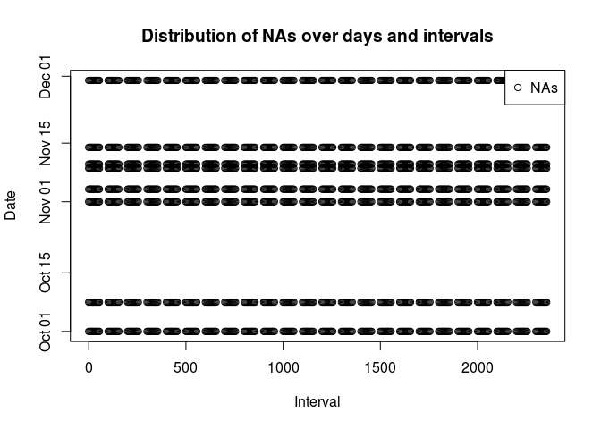
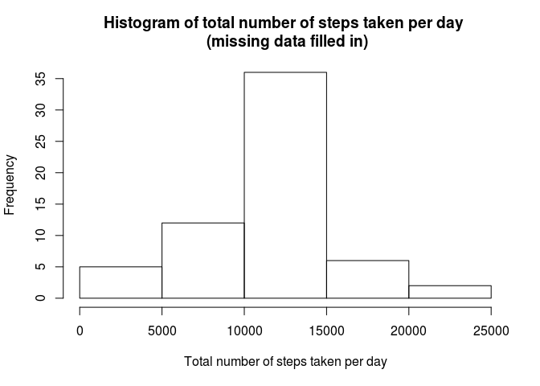
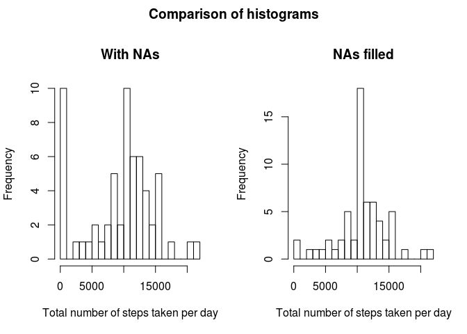
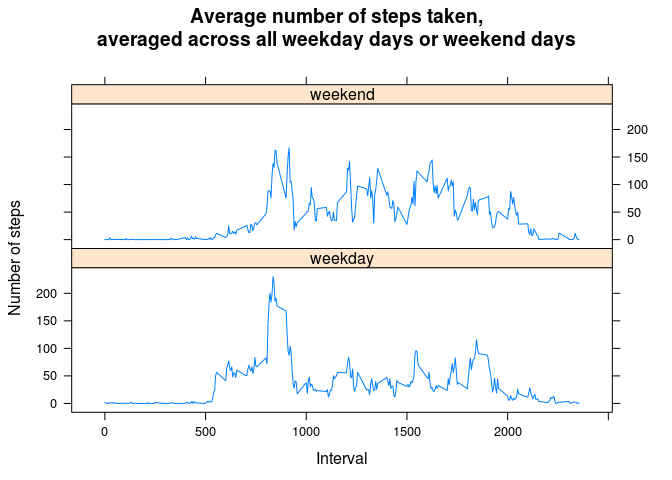

# Reproducible Research: Peer Assessment 1


## Loading and preprocessing the data


```r
Sys.setlocale("LC_TIME", "C")
unzip('activity.zip')
data <- read.csv('activity.csv')
data <- transform(data, date = as.Date(date, format="%Y-%m-%d"))
```


## What is mean total number of steps taken per day?

```r
library(dplyr)
totalStepsByDay <- data %>% group_by(date) %>% summarize(steps = sum(steps, na.rm = T))
with(
  totalStepsByDay,
  hist(
    steps,
    main = "Histogram of total number of steps taken per day",
    xlab = "Total number of steps taken per day"
  )
)
```

 

```r
mean <- mean(totalStepsByDay$steps, na.rm = T)
median <- median(totalStepsByDay$steps, na.rm = T)
```

The mean of the total number of steps taken per day is 9354.23.  
The median of the total number of steps taken per day is 10395.


## What is the average daily activity pattern?


```r
averageStepsByInterval <- data %>% group_by(interval) %>% summarise(steps = mean(steps, na.rm = T))
maxInterval <- averageStepsByInterval$interval[which.max(averageStepsByInterval$steps)]
with(
  averageStepsByInterval,
  plot(
    interval,
    steps,
    type = "l",
    main = "Average number of steps taken, averaged across all days",
    xlab = "Interval",
    ylab = "Number of steps"
  )
)
abline(v=maxInterval, col = "red")
axis(1, at=maxInterval, labels = maxInterval)
legend("topright", lwd=1, col=c('black', 'red'), legend = c('Number of steps', 'Interval with maximum number of steps'))
```

 

The interval identified with value 835 (format "%H%M") is the one
containing the maximum number of steps averaged across all days.

## Imputing missing values

```r
incompleteCases <- !complete.cases(data)
numberOfIncompleteCases <- sum(incompleteCases)
NAs <- data[incompleteCases,]
with(data, plot(interval, date, type="n", xlab = "Interval", ylab = "Date"))
points(NAs$interval, NAs$date, pch=1)
legend("topright", legend = "NAs", pch=1)
title("Distribution of NAs over days and intervals")
```

 

There are 2304 missing values in the data set.  
As you can see in the scatter plot titled "Distribution of NAs over days and intervals",
there are whole missing days or days with all 288 intervals measured.  

For filling in all of the missing values we devise to take the mean for each 5-minute interval over all days.


```r
filled.data <- data
for (rowIndex in which(incompleteCases)) {
  filled.data[rowIndex, "steps"] <- averageStepsByInterval[
    filled.data[rowIndex,"interval"] == averageStepsByInterval$interval,
    "steps"
    ]  
}


filled.totalStepsByDay <- filled.data %>% group_by(date) %>% summarize(steps = sum(steps))
with(
  filled.totalStepsByDay,
  hist(
    steps,
    main = "Histogram of total number of steps taken per day \n (missing data filled in)",
    xlab = "Total number of steps taken per day"
  )
)
```

 

```r
filled.mean <- mean(filled.totalStepsByDay$steps)
filled.median <- median(filled.totalStepsByDay$steps)
```

The mean of the total number of steps taken per day with filled in estimates is
10766.19.  
The median of the total number of steps taken per day with filled in estimates is
10766.19.


```r
par( mfrow = c( 1, 2 ), oma = c( 0, 0, 2, 0 ) )
with(
  totalStepsByDay,
  hist(
    steps,
    main = "With NAs",
    xlab = "Total number of steps taken per day",
    breaks = 25
  )
)
with(
  filled.totalStepsByDay,
  hist(
    steps,
    main = "NAs filled",
    xlab = "Total number of steps taken per day",
    breaks = 25
  )
)
title("Comparison of histograms", outer = T)
```

 

```r
totalStepsOfInsertedDay <- sum(averageStepsByInterval$steps)
numberOfDaysWithNAs<- length(unique(data$date[incompleteCases]))
```

As discovered before looking at the distribution of NAs over days and intervals we filled in about 8 complete days.  
Because complete days with averaged 5-minute intervals have 10766.19 total steps per day, the median and mean with the filled in steps are dominated by this number.  
Without the filled in steps, the 8  days with NAs have 0 steps. You can see this effect in the figure titled "Comparison of histograms".

## Are there differences in activity patterns between weekdays and weekends?

```r
filled.data$dayType <- "weekday"
filled.data$dayType[weekdays(filled.data$date, T) == "Sat" | weekdays(filled.data$date, T) == "Sun"] <- "weekend"
filled.data$dayType <- as.factor(filled.data$dayType)


filled.averageStepsByIntervalAndType <- filled.data %>% group_by(interval, dayType) %>% summarise(steps = mean(steps))
library(lattice)
with(
  filled.averageStepsByIntervalAndType,
  xyplot(
    steps ~ interval | dayType,
    type = "l",
    layout = c(1,2),
    main = "Average number of steps taken,\naveraged across all weekday days or weekend days",
    ylab = "Number of steps",
    xlab = "Interval"
  )  
)
```

 
