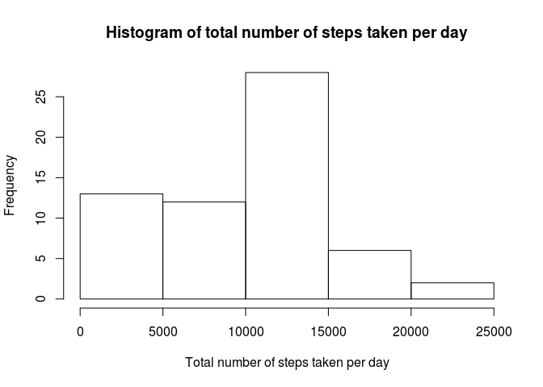

# Reproducible Research: Peer Assessment 1


## Loading and preprocessing the data


```r
unzip('activity.zip')
data <- read.csv('activity.csv')
data <- transform(data, date = as.Date(date, format="%Y-%m-%d"))
```


## What is mean total number of steps taken per day?

```r
library(dplyr)
totalStepsByDay <- data %>% group_by(date) %>% summarize(steps = sum(steps, na.rm = T))
with(
  totalStepsByDay,
  hist(
    steps,
    main = "Histogram of total steps taken per day",
    xlab = "Total steps taken per day"
  )
)
```

 

```r
mean <- mean(totalStepsByDay$steps, na.rm = T)
median <- median(totalStepsByDay$steps, na.rm = T)
```

The mean of the total number of steps taken per day is 9354.2295082.  
The median of the total number of steps taken per day is 10395.


## What is the average daily activity pattern?


```r
averageStepsByInterval <- data %>% group_by(interval) %>% summarise(steps = mean(steps, na.rm = T))
maxInterval <- averageStepsByInterval$interval[which.max(averageStepsByInterval$steps)]
with(
  averageStepsByInterval,
  plot(
    interval,
    steps,
    type = "l",
    main = "Average number of steps taken by interval",
    xlab = "Interval",
    ylab = "Steps averaged across all days"
  )
)
abline(v=maxInterval, col = "red",)
axis(1, at=maxInterval, labels = maxInterval)
legend("topright", lwd=1, col=c('black', 'red'), legend = c('Steps', 'Interval with maximum number of steps'))
```

 

The interval identified with value 835 is the one containing the maximum number of steps averaged across all days.

## Imputing missing values


## Are there differences in activity patterns between weekdays and weekends?
